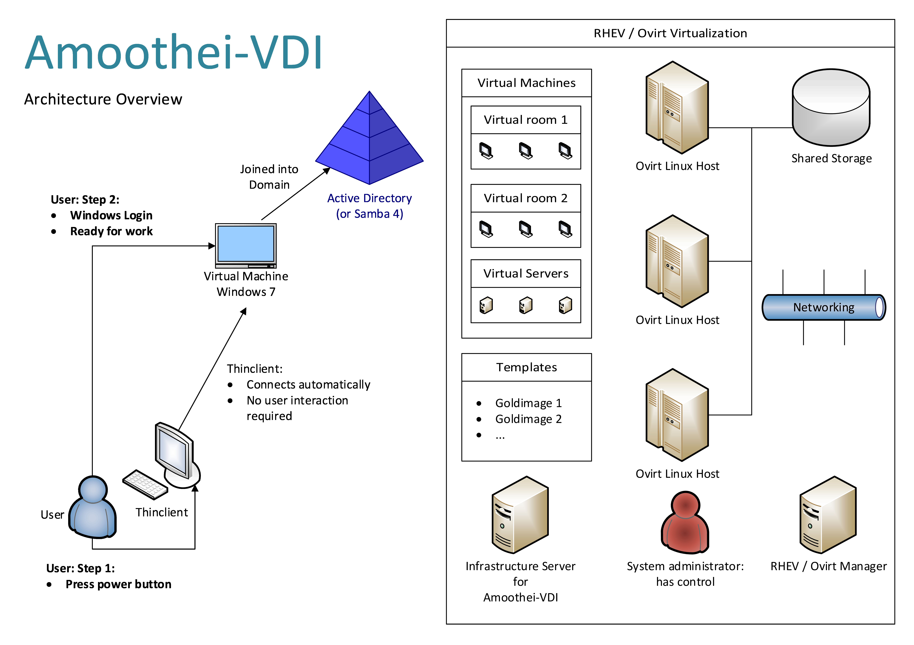
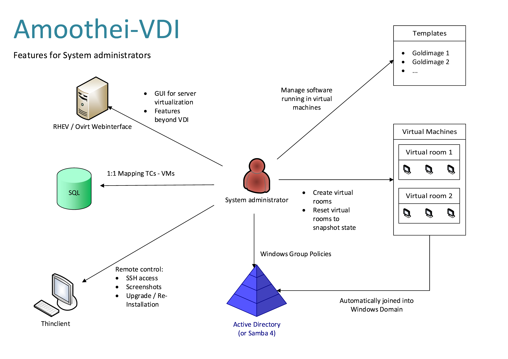
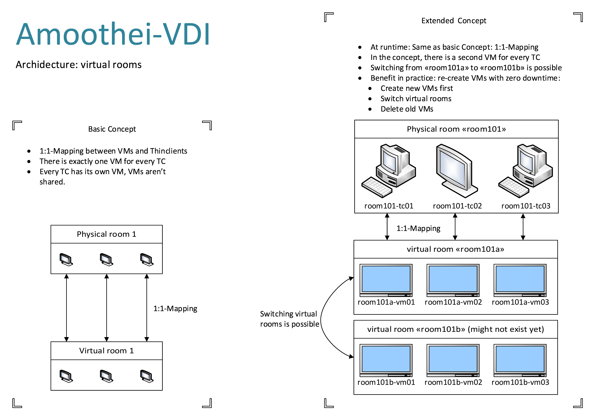
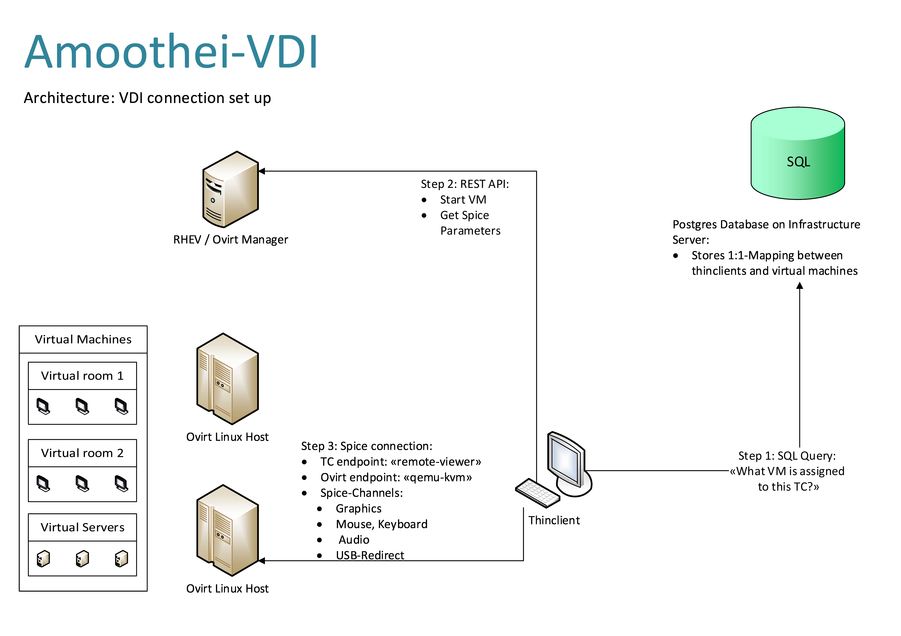
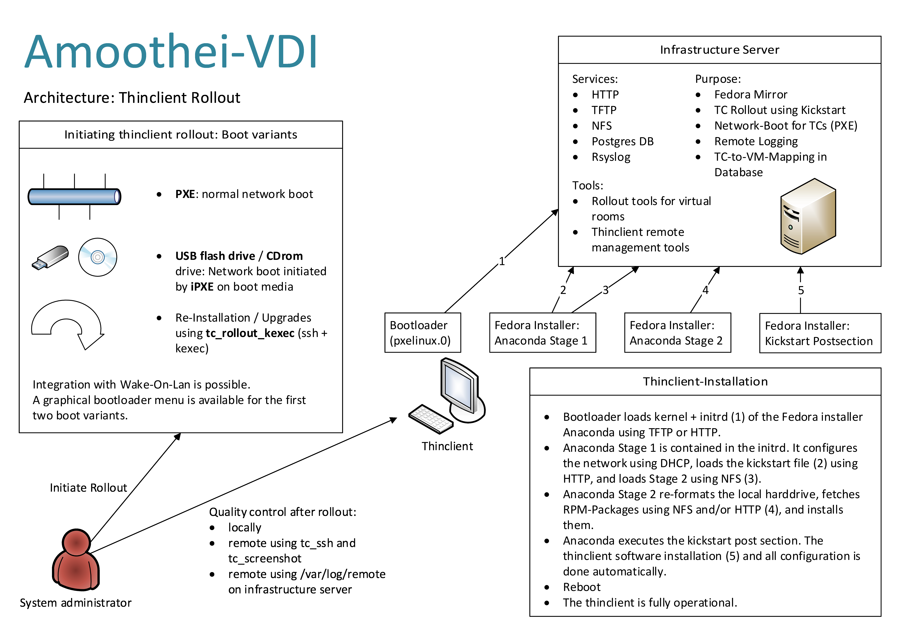

Overview
========

Amoothei-VDI is a `Open Source <license.md>`__ VDI solution based on
Red Hat Enterprise Virtualization (or Ovirt Virtualization) and
the Spice VDI protocol.

.. todo:: Bilder skalieren noch nicht. -> http://stackoverflow.com/questions/12297493/why-does-image-scale-not-work-in-restructuredtext-when-generating-html-files

Architecture Overview
---------------------

Seemless user experience: Ready for work in just two steps

Features for system administrators
----------------------------------

Features that make the live of a system administrator easier:

VDI concept: virtual rooms
--------------------------

Amoothei-VDI uses an 1:1-Mapping between virtual and physical rooms.
This is well-suited for schools and other environments where existing
software depends on the concept of a "classroom".

Thinclient: Connection setup
----------------------------

How thinclients connect to their assiged virtual machine:

Thinclient: Kickstart rollout
-----------------------------

Automatic thinclient rollout using fully automated and unattended
kickstart installation of fedora 22:

